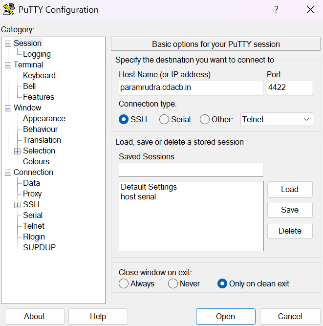
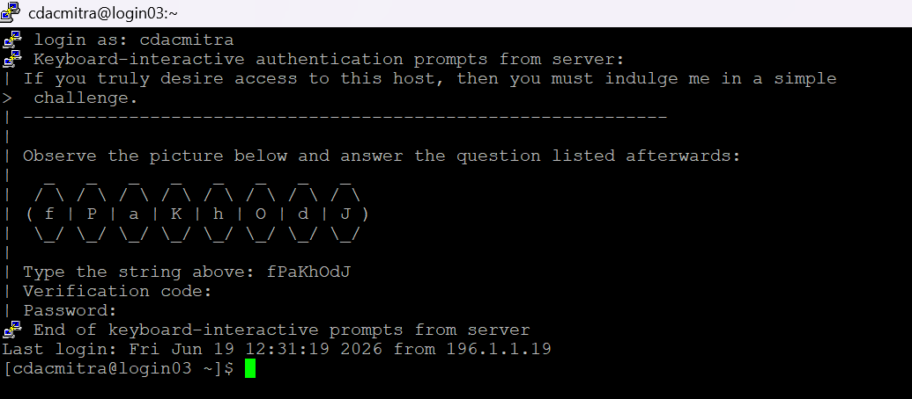
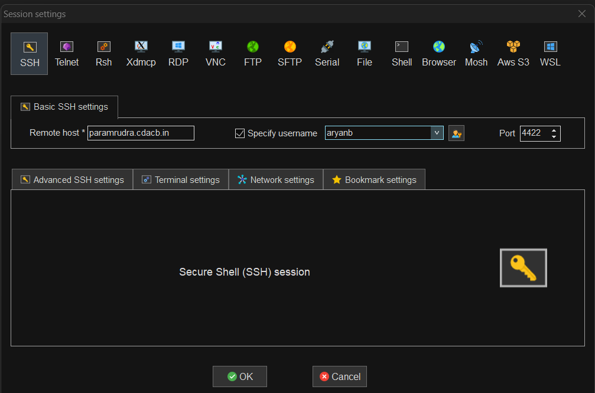
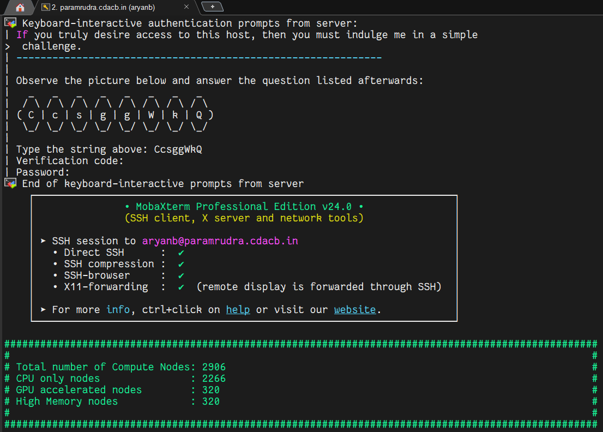
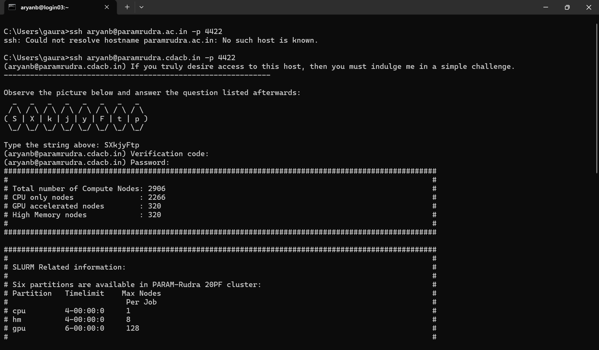
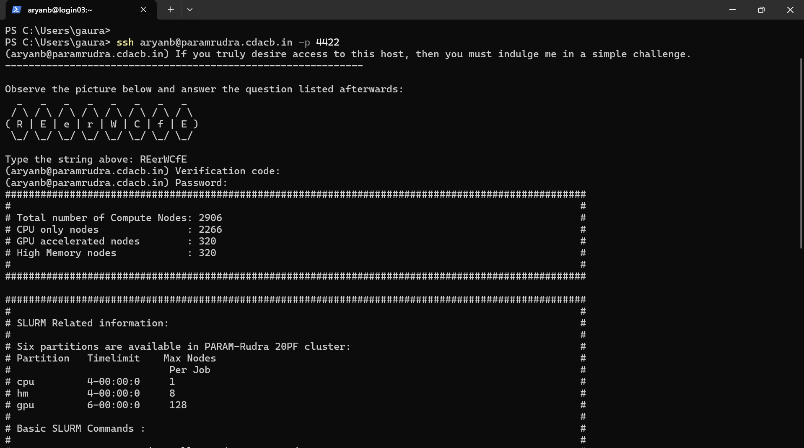

# Getting Access

This page explains how to obtain an account and connect to **PARAM Rudra** over
SSH. Access uses **password authentication protected by Two-Factor Authentication
(2FA)** with Google Authenticator, plus a CAPTCHA.

## 1. Get an account

Accounts are issued through the NSM user-creation portal:

1. Go to **<https://services.nsmindia.in/userportal/account>** (linked from the
   *Access to PARAM Systems* section of [nsmindia.in](https://nsmindia.in)).
2. Register with your **official institutional email**, city and institute.
3. Verify your email, complete the form, and upload the required documents
   (ID proof, User Creation Form, etc.).
4. Your HOD/PI verifies the request; the coordinator selects the cluster; higher
   authority grants final approval.
5. On approval you receive an email with your **user id, a temporary password**,
   and the allocated cluster.

Queries: `nsmsupport@cdac.in`. Full details on the
[Accounts & Acknowledgement](acknowledgement.md) page.

# How to access the cluster

### To access cluster using Windows:
To access PARAM Rudra, several tools are available. Please refer to the details below before using them.
As part of our security policy, Two-Factor Authentication (2FA) using Google Authenticator has been enabled for all users. Authentication is required each time you log in through any of the available access tools.
Please download and install the Google Authenticator application on your smartphone:
- Android (Google Play Store) – Google Authenticator
- iOS (Apple App Store) – Google Authenticator

1. PuTTY is the most popular open source ssh client application for Windows. Following are the steps:
    - Download PuTTY from its official website.
    - Install PuTTY on your computer.
    - Launch Putty from your desktop or Start menu.
    - In the dialog, locate the "Hostname or IP Address" input field.
    - Enter the hostname of the cluster: paramrudra.cdacb.in 
    - For all users, use port 4422 as ssh port.
    - Select open, then enter your username
    - Enter the captcha when prompted.
    - Verification Code :
         a) First-Time Login: During the first login, a QR code will be displayed in the terminal/browser. Open the Google Authenticator app, tap the "+" button, select "Scan a QR Code", and scan the displayed QR code. A new entry will appear in the app (e.g., Cluster: admin1@login). Enter the generated 6-digit OTP to complete the setup.	
         b) Subsequent Logins: For all future logins, enter the 6-digit OTP generated by the Google Authenticator app when prompted for verification.
    - Then enter the password.
    - Press Enter to proceed with the connection.


{ loading=lazy }


{ loading=lazy }


2. Another popular tool is MobaXterm, which is a third party freely available tool which can be used to access the HPC system and transfer files to the PARAM Rudra system through your local systems (laptop/desktop).
Here are the steps:
- Download MobaXterm from its official website.
- Install MobaXterm on your computer.
- Launch MobaXterm from your desktop or Start menu.
- Click on the "Session" button in MobaXterm.
- Enter the hostname, along with your username.
- For all users, use port 4422 as ssh port.
- Enter the captcha when prompted.
- Verification Code :
     a) First-Time Login: During the first login, a QR code will be displayed in the terminal/browser. Open the Google Authenticator app, tap - the "+" button, select "Scan a QR Code", and scan the displayed QR code. A new entry will appear in the app (e.g., Cluster: admin1@login). - Enter the generated 6-digit OTP to complete the setup.
     b) Subsequent Logins: For all future logins, enter the 6-digit OTP generated by the Google Authenticator app when prompted for verification.
- Then enter the password.
- Press Enter to proceed with the connection.


{ loading=lazy }


{ loading=lazy }


3. Command Prompt (Windows native application)
This is a native tool for Windows machines which can be used to transfer data from the PARAM Rudra system through your local systems (laptop/desktop).
a)  To connect to a SSH server, open the terminal of command prompt and type the following command:

**ssh[username]@[hostname] –p 4422**

**For example, to connect to PARAM Rudra cluster:**

**ssh username@paramrudra.cdacb.in -p 4422**

b) Enter the CAPTCHA when prompted. For the first login, a QR code will be displayed in the terminal/browser. Open the Google Authenticator app, tap the "+" button, select "Scan a QR Code", and scan the displayed QR code. A new entry will appear in the app (e.g., Cluster: admin1@login). Enter the generated 6-digit OTP to complete the setup. For all subsequent logins, enter the 6-digit OTP generated by the Google Authenticator app when prompted for verification. Then enter your password and press Enter to proceed with the connection.


{ loading=lazy }


4. PowerShell (Windows native application)
This is a native tool for Windows machines which could be used to transfer data from the PARAM Rudra system through your local systems (laptop/desktop).
a)  To connect to a SSH server, open the terminal of PowerShell and type the following command:

**ssh[username]@[hostname] –p 4422**
**For example, to connect to PARAM Rudra cluster:**
**ssh username@paramrudra.cdacb.in -p 4422**
b) Enter the CAPTCHA when prompted. For the first login, a QR code will be displayed in the terminal/browser. Open the Google Authenticator app, tap the "+" button, select "Scan a QR Code", and scan the displayed QR code. A new entry will appear in the app (e.g., Cluster: admin1@login). Enter the generated 6-digit OTP to complete the setup. For all subsequent logins, enter the 6-digit OTP generated by the Google Authenticator app when prompted for verification. Then enter your password and press Enter to proceed with the connection.


{ loading=lazy }


### To access cluster using Mac or Linux:
Both Mac and Linux systems provide a built-in SSH client, eliminating the need to install any additional package. To connect to a SSH server, open the terminal and type the following command:
ssh[username]@[hostname] –p 4422
For example, to connect to PARAM Rudra cluster:
`ssh username@paramrudra.cdacb.in -p 4422`
Enter the CAPTCHA when prompted. For the first login, a QR code will be displayed in the terminal/browser. Open the Google Authenticator app, tap the "+" button, select "Scan a QR Code", and scan the displayed QR code. A new entry will appear in the app (e.g., Cluster: admin1@login). Enter the generated 6-digit OTP to complete the setup. For all subsequent logins, enter the 6-digit OTP generated by the Google Authenticator app when prompted for verification. Then enter your password and press Enter to proceed with the connection.
After getting credentials you may access the cluster, please remember the following points:
- When you log in to the cluster, you will land on the login nodes. The login node serves as the primary gateway to the rest of the cluster, housing a job scheduler (known as Slurm) and other applications for creating and submitting the job. You can submit jobs to the queue, and they will execute when the required resources become available. 
- Please refrain from running jobs directly on the login node. Login nodes are intended for compiling codes, transferring data and submitting jobs. If you run your job directly on the login node, it will be terminated.
- By default, two directories are available (i.e. /home and /scratch). These directories are available on the login node as well as the other nodes on the cluster. /scratch is for temporary data storage, generally used to store data required for running jobs. Users are requested to regularly back up their own data in scratch directory. As per policy, any files not accessed in the last three months will be permanently deleted.


## Connection details

| Item | Value |
| --- | --- |
| Hostname | `paramrudra.cdacb.in` |
| SSH port | **4422** (non-default — always pass `-p 4422`) |
| Login nodes | 14 nodes; you are assigned one (e.g. `login03`) |
| Auth | Username + **CAPTCHA** + **6-digit OTP** (Google Authenticator) + password |
| Support portal | `https://paramrudra.cdac.in/support` |

## 3. First login

=== "Linux / macOS / PowerShell / cmd"

    ```bash
    ssh <username>@paramrudra.cdacb.in -p 4422
    ```

=== "PuTTY (Windows)"

    1. **Host Name:** `paramrudra.cdacb.in`  **Port:** `4422`  **Type:** SSH
    2. Click **Open** and enter your username.

=== "MobaXterm (Windows)"

    1. **Session → SSH**, remote host `paramrudra.cdacb.in`, specify username.
    2. **Port:** `4422`. Start the session.

The first login sequence:

1. Enter the **CAPTCHA** shown in the terminal.
2. A **QR code** is displayed. In Google Authenticator tap **➕ → Scan a QR code**
   and scan it. A new entry appears (e.g. `Cluster: you@login`).
3. Enter the **6-digit OTP** from the app to complete 2FA setup.
4. Enter your **temporary password**. You are then required to **set a new
   password** of your own.

**Every subsequent login:** username → CAPTCHA → current 6-digit OTP → password.

!!! success "You are on a login node"
    Login nodes are shared gateways for **editing, compiling, data transfer and
    job submission** — never for running computations. See [Policies](policies.md).

## Passwords

- Your new password must be strong (upper + lower case, digits, a few special
  characters).
- Passwords are valid for **90 days**; you are prompted to change on expiry.
- Change it any time with:
  ```bash
  passwd
  ```
- **Forgot your password?** Raise a ticket at
  `https://paramrudra.cdac.in/support`; after email verification the support team
  resets it and emails you a temporary password to change on next login.

## Optional: SSH config convenience

You can still shorten the command with a host alias in `~/.ssh/config` on your
local machine (you will still be prompted for CAPTCHA/OTP/password):

```ssh-config
Host rudra
    HostName paramrudra.cdacb.in
    Port 4422
    User <username>
    ServerAliveInterval 60
```

Then just `ssh rudra`.

!!! note "2FA and SSH keys"
    Because interactive 2FA (OTP + CAPTCHA) is enforced at login, plain SSH
    public-key login is generally **not** the access path here — use your
    password + Authenticator OTP as above. If you have a specific need for
    key-based automation, ask the [support desk](support.md) what is permitted.

## Copying files in and out

Use port **4422** for all transfers (SFTP too — not port 22).

```bash
# Upload (note: scp uses -P, capital)
scp -r -P 4422 ./localdir <username>@paramrudra.cdacb.in:/home/<username>/

# Download results
scp -P 4422 <username>@paramrudra.cdacb.in:/scratch/<username>/out.nc ./

# Efficient, resumable sync (rsync/ssh use -p, lowercase)
rsync -avP -e "ssh -p 4422" ./project/ <username>@paramrudra.cdacb.in:/scratch/<username>/project/
```

GUI tools that work well on Windows:

- **WinSCP** — drag-and-drop file transfer (set the port to **4422**).
- **MobaXterm** — integrated SSH terminal + SFTP browser.

!!! note "`scp` uses `-P`, `ssh`/`rsync` use `-p`"
    A common trip-up: for `scp`/`sftp` the port flag is uppercase **`-P 4422`**;
    for `ssh` and `rsync -e ssh` it is lowercase **`-p 4422`**.

## Troubleshooting login

| Symptom | Likely cause / fix |
| --- | --- |
| `Connection timed out` | Port 4422 blocked by your firewall/VPN, or wrong network. Ensure your network/firewall allows access to the HPC system. |
| OTP rejected | Phone clock drift, or wrong Authenticator entry. Ensure automatic time is on; use the entry created for this cluster. |
| Password rejected on first login | Use the exact temporary password from the welcome email; you will be forced to change it. |
| Locked out / lost 2FA device | Raise a ticket at `https://paramrudra.cdac.in/support`. |
| `Permission denied` repeatedly | Account may be expired (90-day password) — reset via ticket. |

Next: set up your working [Environment](environment.md).
