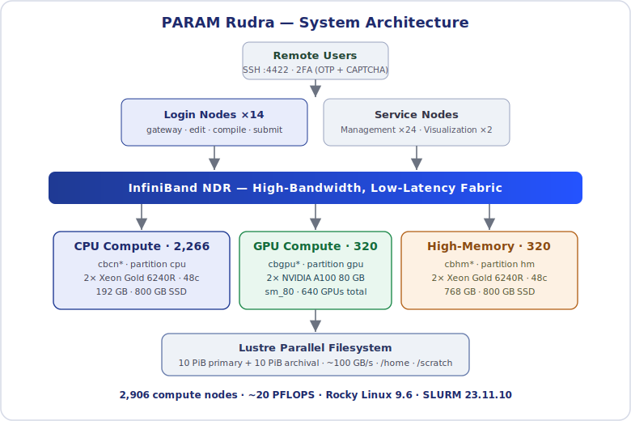
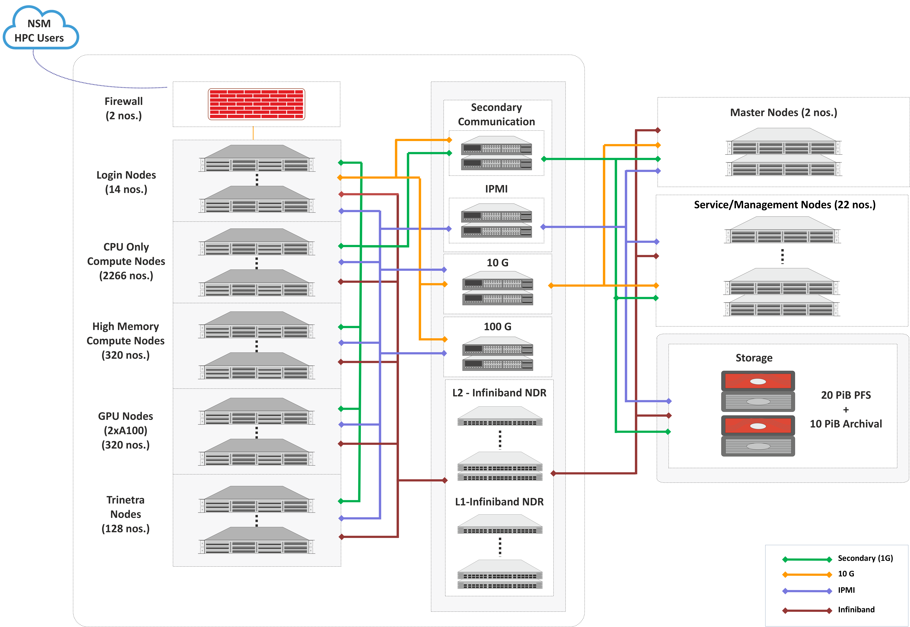
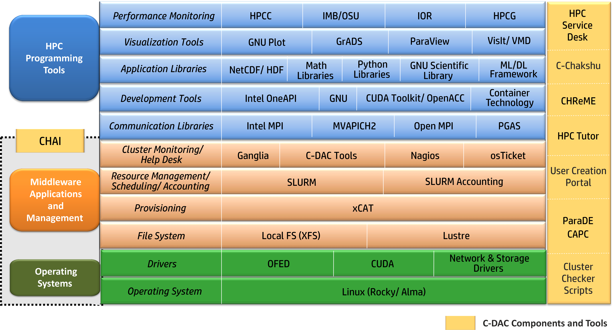

# System Configuration

PARAM Rudra is the ~20 PetaFlop supercomputing facility at **C-DAC Bangalore**,
designed and implemented by the HPC Technologies group of C-DAC under the
National Supercomputing Mission (NSM). It is a heterogeneous, hybrid system based
on **Intel Xeon (2nd Gen Cascade Lake) processors** and **NVIDIA A100 GPUs**.

## Architecture diagram

{ loading=lazy }

## Headline numbers

| Metric | Value |
| --- | --- |
| Peak performance | **~20 PFLOPS** (CPU + GPU + HM) |
| Total nodes | 2,946 |
| Compute nodes | **2,906** (2,266 CPU + 320 GPU + 320 high-memory) |
| Login nodes | 14 |
| Management nodes | 24 |
| Visualization nodes | 2 |
| Interconnect | InfiniBand **NDR** (primary) + 10 Gbps Ethernet (secondary) |
| Parallel filesystem | **Lustre** — 10 PiB primary + 10 PiB archival, ~100 GB/s |
| Operating system | Rocky Linux 9.6 |
| Scheduler | SLURM 23.11.10 |

## Node types and per-node hardware

| Node class | Count | CPU | Cores/node | Memory/node | Local SSD | GPUs | Partition |
| --- | --- | --- | --- | --- | --- | --- | --- |
| **CPU compute** | 2,266 | 2× Intel Xeon Gold 6240R @ 2.4 GHz | 48 | 192 GB DDR4-2933 | 800 GB | — | `cpu` |
| **GPU compute** | 320 | 2× Intel Xeon Gold 6240R @ 2.4 GHz | 48 | 192 GB DDR4-2933 | 800 GB | **2× NVIDIA A100 (80 GB HBM2e)** | `gpu` |
| **High-memory** | 320 | 2× Intel Xeon Gold 6240R @ 2.4 GHz | 48 | **768 GB** | 800 GB | — | `hm` |
| **Login** | 14 | 2× Intel Xeon Gold 6240R @ 2.4 GHz | 48 | 192 GB | — | — (interactive gateway) |

!!! info "Node naming convention"
    Hostnames encode the class: `cb` (C-DAC Bengaluru) + class
    (`cn` = compute, `gpu` = GPU, `hm` = high-memory) + a 4-digit index —
    e.g. `cbcn0001`, `cbgpu0044`, `cbhm0193`. You will always land on a login
    node such as `login03`.

Each **A100** provides 80 GB HBM2e and 6,912 CUDA cores; with 2 per GPU node that
is 13,824 CUDA cores and 160 GB of GPU memory per node.

!!! tip "Confirm live specs on an allocated node"
    Specs above are from the official system documentation. To verify what a
    given job actually sees, run these **on a compute node** (inside a job), not
    on the login node:
    ```bash
    lscpu                 # sockets, cores, model name
    free -h               # memory
    numactl --hardware    # NUMA layout
    nvidia-smi            # GPUs (on a gpu node)
    ```

## Interconnect

- **Primary (message-passing) fabric:** InfiniBand **NDR** — high-bandwidth,
  low-latency; carries MPI traffic and Lustre I/O. This is what lets
  tightly-coupled jobs scale across many nodes.
- **Secondary fabric:** 10 Gbps Gigabit Ethernet — management and general I/O.
  Open MPI and MPICH both work over Ethernet with no extra configuration.

## Storage

- Based on the Lustre parallel file system.
- The storage subsystem provides a total usable capacity of 20 PiB Primary Storage and 10 PiB Archival Storage.
- Of the 20 PiB primary storage, 18 PiB delivers a throughput of 150 GB/s, while the remaining 2 PiB is flash-based and provides a throughput of 500 GB/s.

{ loading=lazy }

Storage is a **Lustre** parallel filesystem:

| Path | Purpose | Quota (soft) | Backed up? | Purge |
| --- | --- | --- | --- | --- |
| `/home/<user>` | Code, scripts, small inputs, results to keep | **50 GB** | Per site policy | No |
| `/scratch/<user>` | High-performance working space for jobs | **200 GB** | **No** | Files not accessed in **3 months** are deleted |

Total usable capacity is 10 PiB (primary) + 10 PiB (archival), with ~100 GB/s
throughput. See [Data Management](data.md) for quotas, Lustre striping and the
purge policy.

## Software stack

{ loading=lazy}


| Functional area | Component(s) |
| --- | --- |
| Operating system | Rocky Linux 9.6 (x86_64) |
| Provisioning / cluster manager | xCAT |
| Monitoring | **C-CHAKSHU**, Nagios, Ganglia |
| Resource manager | SLURM 23.11.10 |
| I/O | Lustre client |
| Interconnect stack | Mellanox InfiniBand (MLNX_OFED) |
| Compilers | GNU (gcc/g++/gfortran), Intel oneAPI (icx/icpx/ifx) |
| MPI | MVAPICH, Open MPI, MPICH, Intel MPI |
| Package manager | **Spack** (primary), Environment Modules, Miniconda |

**C-CHAKSHU** is C-DAC's multi-cluster management dashboard; users can monitor
CPU, storage, interconnect, filesystem and application utilization from a single
web dashboard.

## Partitions (queues)

Three user partitions map to the three compute node types. Limits below are from
the **live SLURM configuration** on the login banner:

| Partition | Max wall time | Max nodes / job | Target hardware |
| --- | --- | --- | --- |
| `cpu` *(default)* | `4-00:00:00` (4 days) | 1 | CPU-only `cbcn*` |
| `hm` | `4-00:00:00` (4 days) | 8 | High-memory `cbhm*` (768 GB) |
| `gpu` | `6-00:00:00` (6 days) | 128 | GPU `cbgpu*` (2× A100) |

Additional partitions (e.g. benchmarking pools such as `hpl02`) may appear in
`sinfo` and are generally reserved for system/administrative use.

!!! note "Older docs mention a `standard` partition"
    Some C-DAC sample scripts use `--partition=standard`. On this system the
    actual partitions are **`cpu`, `hm`, `gpu`**. Use those. Always confirm live
    limits with:
    ```bash
    sinfo -s
    scontrol show partition cpu
    ```

Continue to [Environment](environment.md), or jump to the
[Batch System](batch.md) to start submitting jobs.
