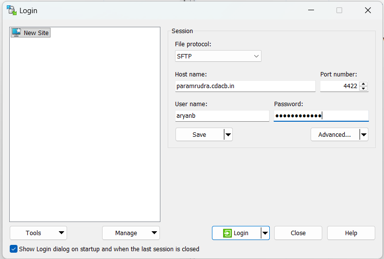
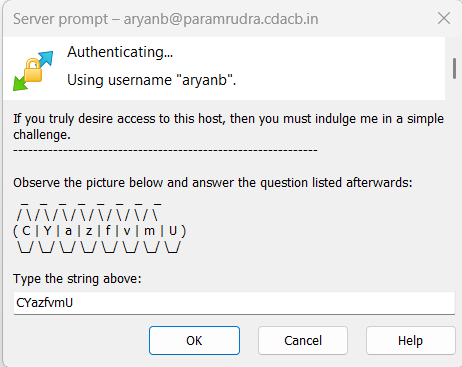
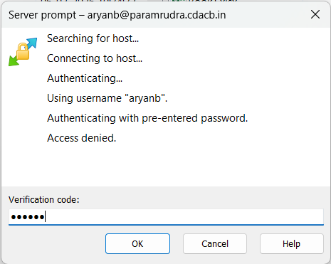

# Environment

This page covers your shell, the module system, your file systems, and the
default Conda base environment you land in.

## Your shell

The default login shell is **bash**. When you log in you will typically see a
prompt like:

```text
(base) [samirs@login03 ~]$
```

The `(base)` prefix indicates that a **Conda base environment** is active by
default (see [Conda / Python](#conda-and-python) below).

Customise your environment through the usual bash startup files in `/home`:

- `~/.bashrc` — interactive shell settings, aliases, `module load` lines you
  want every session.
- `~/.bash_profile` — login-shell settings (often just sources `~/.bashrc`).

!!! warning "Keep startup files fast and safe"
    Avoid heavy commands, network calls, or `module load` of large stacks in
    `~/.bashrc` — they run on **every** shell, including inside every job step
    and can slow down or break batch jobs. Prefer loading modules explicitly in
    your job scripts.

## File systems

| Variable / Path | Use it for | Soft quota | Watch out for |
| --- | --- | --- | --- |
| `/home/$USER` (`$HOME`) | Code, scripts, configs, small files | **50 GB** | Not for heavy job I/O |
| `/scratch/$USER` | Fast working space for running jobs | **200 GB** | **3-month access-time purge**; not backed up |

Both live on the **Lustre** parallel filesystem. Stage inputs into `/scratch`,
run there, then copy results you want to keep back to `/home` (or off-cluster).

Recommended pattern:

```bash
# 1. Keep your code and job scripts in $HOME
cd $HOME/myproject

# 2. Stage inputs and run in /scratch (fast parallel filesystem)
mkdir -p /scratch/$USER/myproject/run01
cd /scratch/$USER/myproject/run01

# 3. After the run, move important results to safe long-term storage
```

Check your usage and quota:

```bash
# Disk usage of a directory
du -sh /scratch/$USER/*

# Lustre quota (soft: 50 GB /home, 200 GB /scratch)
lfs quota -h -u $USER /home
lfs quota -h -u $USER /scratch
```

Grab C-DAC's worked sample programs (serial/OpenMP/MPI/CUDA/OpenACC/MKL) to get
started:

```bash
cp -r /home/apps/Docs/samples/ ~/
```

!!! danger "Back up your data"
    `/scratch` is purged and neither filesystem should be treated as an archive.
    Regularly copy results you cannot regenerate to your own institutional
    storage. See [Data Management](data.md).

## Identify where you are

```bash
hostname          # e.g. login03, cbcn0421, cbgpu0044
echo $SLURM_JOB_ID    # non-empty only inside a job
groups            # your groups / possible accounts
sacctmgr show assoc user=$USER format=account,partition -p 2>/dev/null  # your accounts
```

## Environment modules

Software is provided through **environment modules** so you can select specific
compilers, MPI libraries and applications without conflicts.

```bash
module avail                 # list everything available
module avail 2>&1 | grep -i openmpi   # search (module output goes to stderr)
module load gcc/12           # load a specific version
module list                  # what is currently loaded
module unload gcc/12         # remove one module
module purge                 # remove all modules (clean slate)
module show openmpi          # see what a module sets (paths, vars)
```

Software on PARAM Rudra is provided primarily through **[Spack](spack.md)**
(`spack load ...`), with **Environment Modules** used to enable Spack, Miniconda
and the ML/DL Conda environments:

```bash
module load spack
. /home/apps/spack/share/spack/setup-env.sh   # enable Spack (note leading dot)
spack find                                     # what's installed
```

The module system and Conda are covered on the [Modules & Conda](modules.md)
page; Spack in depth on the [Spack Packages](spack.md) page.

!!! tip "`module avail` prints to stderr"
    To search it, redirect stderr into the pipe: `module avail 2>&1 | grep -i cuda`.

## Conda and Python

You land in a Conda **base** environment (`(base)` in your prompt). Do **not**
install packages into `base` — create your own named environments instead:

```bash
# Create a project environment
conda create -n myenv python=3.11 numpy scipy
conda activate myenv

# ... work ...

conda deactivate
```

If you prefer not to start in `base` automatically:

```bash
conda config --set auto_activate_base false   # takes effect next login
```

!!! warning "Do not build Conda environments on the login node under load"
    Large `conda`/`pip` installs are I/O and CPU heavy. For big environments,
    do the install inside an [interactive job](batch.md#interactive-jobs) or a
    short batch job, and consider placing large environments under `/scratch`
    (mindful of the purge policy) rather than filling your `$HOME` quota.

See [Building Software](building.md) for compilers, MPI and CUDA, and for using
`pip`/`venv` and Julia.

## Transferring files between local machine and HPC cluster

Users need to have their data and applications related to their project or research work on PARAM Rudra. To store the data, special directories named “home” have been made available to the users. While these directories are common to all the users, each user will have their own directory with their username in the “/home/” directory, where they can store their data.

`/home/<username>/`  This directory is generally used by the user to store their data and if needed install their own applications.
However, there is a limit to the storage provided to users. The limits have been defined according to quota over these directories, and all users will be allotted the same quota by default. When a user wishes to transfer data from their local system (laptop/desktop) to the HPC system, they can use various methods and tools.

A user using the ‘Windows’ operating system will have access to methods and tools native to Microsoft Windows, as well as tools that can be installed on their Windows machine. Linux operating system users, however, do not require any tool. They can simply use the “scp” command on 
their terminal. Here’s how:

```bash 
scp -P 4422 <path to the local data directory>
 <username>@paramrudra.cdacb.in:<path to directory on HPC where to save the data>

```

Example:

```bash
scp -P 4422  file  samirs@paramrudra.cdacb.in:/scratch/samirs/
rsync -avP -e "ssh -p 4422"  ./dir/  samirs@paramrudra.cdacb.in:/scratch/samirs/dir/
```
Quick reference (full details on the [Data Management](data.md) page):

Same Command could be used to transfer data from the HPC system to another HPC system, or your own system.

```bash 
scp -r -P 4422 <file path> <username@<cluster IP/hostname>:/home/user/<path>

```
**Note:** use port 4422 for your system.

**Note:** The local system (laptop/desktop) must be connected to a network that allows access to the HPC system. Additionally, please ensure that the firewall settings on your laptop are configured to allow access from the HPC system.
Users are advised to keep a copy of their data once their project or research work is completed by transferring the data from PARAM Rudra to their local system (laptop/desktop). The command below can be used for file transfers in all the tools.

## Tools

### WinSCP (Windows installable application)

This popular tool is freely available and is used very often to transfer data from Windows machine to Linux machine. This tool is GUI based which makes it very user-friendly.

Link for this tool: <https://winscp.net/eng/download.php>
<br>

{ loading=lazy}

Figure : A snapshot of the "WinSCP" tool to transfer file to and from remote computer.

<br>

{ loading=lazy }

Figure : Enter Captcha/String

<br>

{loading=lazy}

Figure :  Enter Verification Code 
<br>

**Note:** Port Used for SFTP connection is 4422 and not 22. Please change it to 4422

## Using Git on the cluster

Git is available for pulling your code onto the system:

```bash
module avail 2>&1 | grep -i git    # a newer git may be provided as a module
git clone https://github.com/<you>/<repo>.git
```

!!! danger "Never store credentials or tokens in the repo or in plain files"
    Do not commit SSH private keys, passwords or Personal Access Tokens. Use SSH
    keys or a short-lived credential helper, and keep secrets out of `$HOME`
    files that might be shared or backed up.
