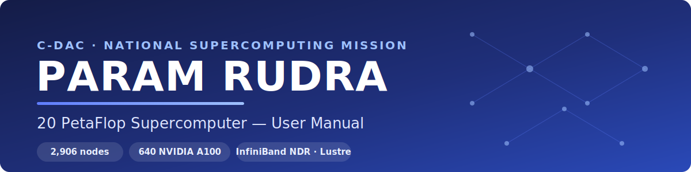

# PARAM Rudra — 20 PetaFlop System User Manual

{ loading=lazy }

Welcome to the user documentation for **PARAM Rudra**, a ~20 PetaFlop
supercomputer operated under the **National Supercomputing Mission (NSM)** by
**C-DAC**. This guide walks you through everything from your first login to
running large-scale CPU, high-memory and GPU jobs through the SLURM batch
system.

[:material-file-pdf-box: Download the full manual (PDF)](assets/PARAM-Rudra-20PF-User-Manual.pdf){ .md-button .md-button--primary }
[:material-server-network: System architecture](configuration.md#architecture-diagram){ .md-button }

*PARAM Rudra is implemented by C-DAC under the National Supercomputing Mission,
supported by MeitY and DST, Government of India.*{ .cobrand-caption }

!!! tip "New here? Start with these three pages"
    1. [Getting Access](access.md) — connect over SSH (port **4422**).
    2. [Environment](environment.md) — modules, shell and your `/home` & `/scratch` directories.
    3. [Batch System (SLURM)](batch.md) — never run compute on the login node; submit jobs instead.

## System at a glance

| Resource | Count | Node name prefix | Partition |
| --- | --- | --- | --- |
| **Total compute nodes** | **2,906** | — | — |
| CPU-only nodes (2× Xeon Gold 6240R, 48c, 192 GB) | 2,266 | `cbcn####` | `cpu` |
| GPU nodes (+ 2× NVIDIA A100 80 GB) | 320 | `cbgpu####` | `gpu` |
| High-memory nodes (768 GB RAM) | 320 | `cbhm####` | `hm` |
| Peak performance | ~20 PFLOPS | — | — |
| Interconnect | **InfiniBand NDR** | — | — |
| Storage | **Lustre** (10 PiB + 10 PiB archival) | — | — |
| OS / scheduler | Rocky Linux 9.6 / SLURM 23.11.10 | — | — |
| Login nodes | 14 (`login01…`) | — | — |

<div class="grid cards" markdown>

- :material-login: **[Getting Access](access.md)**

    SSH key setup, first login on port 4422, and login-node etiquette.

- :material-server-network: **[System Configuration](configuration.md)**

    Node types, partitions, interconnect and storage layout.

- :material-package-variant: **[Modules & Spack](modules.md)**

    Load compilers, libraries and applications with `module` and `spack`.

- :material-hammer-wrench: **[Building Software](building.md)**

    Intel/GNU compilers, MPI wrappers, CUDA (A100 `sm_80`), MKL, OpenACC.

- :material-calendar-clock: **[Batch System (SLURM)](batch.md)**

    Partitions, `sbatch` scripts, `srun`, dependencies and interactive jobs.

- :material-expansion-card: **[GPU Computing](gpu.md)**

    Requesting A100 GPUs, CUDA MPS, multi-GPU and multi-node runs.

- :material-brain: **[Machine Learning / DL](machine-learning.md)**

    Pre-built PyTorch/TensorFlow Conda envs and Jupyter on GPU nodes.

- :material-flask: **[Applications](applications/index.md)**

    GROMACS, LAMMPS, WRF, OpenFOAM, NAMD and more via Spack.

- :material-speedometer: **[Best Practices & Performance](best-practices.md)**

    Compiler tuning (GCC/Intel LLVM/NVHPC), OpenMP, MPI, case studies.

</div>

## The golden rules

!!! danger "Do not run jobs on the login node"
    Running compute-heavy processes on a login node degrades service for
    everyone and **will result in your process being terminated without prior
    notice** (repeat offences may cost you account access). Always submit work
    through SLURM — see the [Batch System](batch.md) page.

!!! warning "`/scratch` is purged"
    Files in `/scratch` that have **not been accessed in the last 3 months are
    permanently deleted**. `/scratch` is fast working space, **not** long-term
    storage. Back up important results elsewhere — see [Data Management](data.md).

## Quick reference card

```bash
# Connect (replace <username>; needs CAPTCHA + Google Authenticator OTP + password)
ssh <username>@paramrudra.cdacb.in -p 4422

# Software: Spack (primary) + modules
module load spack
. /home/apps/spack/share/spack/setup-env.sh
spack find                   # installed packages
spack load <pkg>             # load one
module load miniconda        # Python / Conda ML environments

# SLURM essentials
sinfo                        # partition / node status
squeue -u $USER              # your jobs
sbatch job.slurm             # submit a batch job
salloc ...                   # interactive allocation
scancel <jobid>              # cancel a job

# Always specify your accounting/project code
#SBATCH -A <your_account>
```

---

!!! note "About this manual"
    This is a **community/user-maintained** guide for the C-DAC PARAM Rudra
    20 PetaFlop supercomputer, grounded in the **official C-DAC PARAM Rudra User
    Manual** plus the live login banner and SLURM configuration. Where a value
    may change over time (versions, quotas, hashes), the page tells you the
    command to confirm it on the system. The authoritative source is always the
    **login banner** and the C-DAC support desk (`rudrasupport@cdac.in`).
    Corrections are welcome via
    [pull request](https://github.com/samcom12/paramrudra-user-manual).
