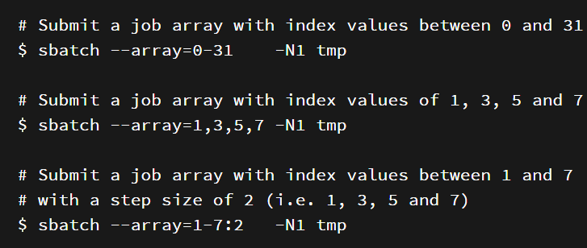
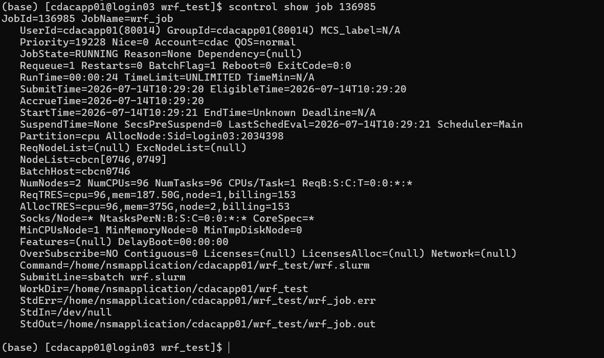
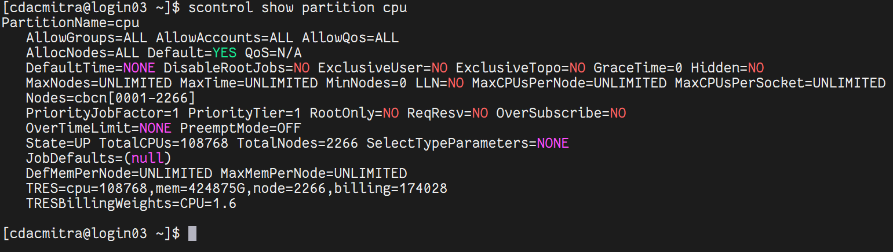

This section explains how you interact with the resource manager. It covers information about the resource manager, the definition of nodes within partitions, job policies, scheduler information, the process of submitting jobs to the cluster, monitoring active jobs and getting useful information about resource usage.

A cluster is a group of computers that work together to solve complex computational tasks and presents itself to the user as a single system. For the resources of a cluster (e.g. CPUs, GPUs, memory) to be used efficiently, a resource manager (also called workload manager or batch-queuing system) is important. While there are many different resource managers available, the resource manager at PARAM Rudra is SLURM. After submitting a job to the cluster, SLURM will try to fulfill the job’s resource request by allocating resources to the job. If the requested resources are already available, the job can start immediately. Otherwise, the start of the job is delayed (pending) until enough resources are available. SLURM allows you to monitor active (pending, running) jobs and to retrieve statistics about finished jobs. 

SLURM, which is an open-source workload manager, efficiently allocates computing resources such as CPUs, GPUs, and memory to users' jobs, ensuring optimal resource utilization and job scheduling. SLURM provides features for job submission, monitoring, and management, allowing users to specify job requirements and dependencies. Slurm is a widely used batch scheduler in the top500 HPC list.

## SLURM Partitions

Partition is a logical grouping of nodes that share similar characteristics or resources. Partitions are helpful to manage and allocate resources efficiently based on the specific requirements of jobs or users. PARAM Rudra consists of three types of computational nodes: i.e. CPU only nodes, High memory (with 768 GB memory) nodes and GPU-enabled GPGPU nodes.

The following partitions/queues have been defined to meet different user requirements:

1. **cpu:** This partition is specifically designed for nodes that only have CPU resources.

2. **gpu:** The GPU partition includes nodes equipped with NVIDIA A100 GPUs. Jobs submitted to this partition will run on nodes that can leverage the high-performance computing capabilities of A100 GPU cards for parallel processing tasks.  The GPU partition exclusively contains GPU nodes. If a user wishes to submit a job only on GPU nodes, they need to specify the number of GPU cards with the partition name.
3. **hm:** The High Memory partition is intended for nodes with a substantial amount of RAM. Specifically, it accommodates CPU nodes that are equipped with 768 GB of RAM, allowing jobs requiring large memory resources to be executed efficiently.

### QoS Job policy

Users have the flexibility to run up to 10 simultaneous jobs. They can run an 8-node job for 4 days, a 16-node job for 2 days, or a 32-node job for 1 day. The default policy of the cluster allows for a maximum wall time of 4 days per job. However, this policy can be tailored to individual user needs or adjusted for all users in the future, depending on cluster usage. Users will be informed about any changes made to the SLURM policy.

**Walltime :** 
The walltime parameter defines how long your job will run, with the maximum runtime determined by the QoS Policy. The default walltime for every job is 2 hours, so users are requested to explicitly specify the walltime in their scripts. If more than 4 days are required, users can raise a query on the support portal of PARAM Rudra, and it will be addressed on a case-by-case basis. If a job exceeds the specified walltime in the script, it will be terminated. Specifying the appropriate walltime improves scheduling efficiency, resulting in enhanced throughput for all jobs, including yours. 

### Schudeling Type

PARAM Rudra has been configured with Slurm’s backfill scheduling policy. It is good for ensuring higher system utilization; it will start lower priority jobs if doing so does not delay the expected start time of any higher priority jobs. Since the expected start time of pending jobs depends upon the expected completion time of running jobs, reasonably accurate time limits are important for backfill scheduling to work well.

**Job Priority :**

The job's priority at any given time will be a weighted sum of all the factors that have been enabled in the slurm.conf file. Job priority can be expressed as:

```bash 
Job_priority =
	site_factor +
	(PriorityWeightAge) * (age_factor) +
	(PriorityWeightAssoc) * (assoc_factor) +
	(PriorityWeightFairshare) * (fair-share_factor) +
	(PriorityWeightJobSize) * (job_size_factor) +
	(PriorityWeightPartition) * (priority_job_factor) +
	(PriorityWeightQOS) * (QOS_factor) +
	SUM(TRES_weight_cpu * TRES_factor_cpu,
	    TRES_weight_<type> * TRES_factor_<type>,
	    ...)
	- nice_factor

```

All of the factors in this formula are floating point numbers that range from 0.0 to 1.0. The weights are unsigned, 32-bit integers. The larger the number, the higher the job will be positioned in the queue, and the sooner the job will be scheduled. A job's priority, and hence its order in the queue, can vary over time. For example, the longer a job sits in the queue, the higher its priority will grow when the age weight is non-zero.

**Age Factor:** The age factor represents the length of time a job has been sitting in the queue and eligible to run. 

**Association Factor:** Each association can be assigned an integer priority. The larger the number, the greater the job priority will be for jobs that request this association. This priority value is normalized to the highest priority of all the associations to become the association factor.

**Job Size Factor:** The job size factor correlates to the number of nodes or CPUs the job has requested. 

**Nice Factor:** Users can adjust the priority of their own jobs by setting the nice value on their jobs. Like the system nice, positive values negatively impact a job's priority and negative values increase a job's priority. Only privileged users can specify a negative value.

**Partition Factor:** Each node partition can be assigned an integer priority. The larger the number, the greater the job priority will be for jobs that request to run in this partition.

**Quality of Service (QOS) Factor:** Each QOS can be assigned an integer priority. The larger the number, the greater the job priority will be for jobs that request this QOS. 

**Fair-share Factor:** The fair-share component to a job's priority influences the order in which a user's queued jobs are scheduled to run based on the portion of the computing resources they have been allocated and the resources their jobs have already consumed. 

### Job Submition

We can submit jobs either through a Slurm script or by using the interactive method. Creating a Slurm script is the optimal way to submit a job to the cluster.

**Submitting Batch Scripts Jobs**

Here is the example of sample slurm script:

```bash  

#!/bin/bash
#SBATCH -N 1   			// number of nodes
#SBATCH --ntasks-per-node=1 	// number of cores per node
#SBATCH --error=job.%J.err 	// name of output file
#SBATCH --output=job.%J.out 	// name of error file
#SBATCH --time=01:00:00    	// time required to execute the program
#SBATCH --partition=standard // specifies queue name (standard is the default partition if you do not specify any partition job will be submitted using default partition). For other partitions you can specify hm or gpu

// To load the package //
spack load intel-oneapi-compilers

cd  <Path of the executable>
a.out  (Name of the executable)

```

We can consider four cases of submitting a job here:

1.1 **Submitting a simple standalone job:**

This is a simple submit script which is to be submitted

```bash 
$ sbatch slurm-job.sh
```

`Submitted batch job 106`

1.2 **Submit a job that's dependent on a prerequisite job being completed:**

Consider a requirement of pre-processing a job before proceeding to actual processing. Pre-processing is generally done on a single core. In this scenario, the actual processing script is dependent on the outcome of the pre-processing script.

Here’s a simple job script. 

Note that the Slurm -J option is used to give the job a name.

```bash
#!/bin/bash
#SBATCH -p standard
#SBATCH -J simple
sleep 60
Submit the job:  
$ sbatch simple.sh

```

`Submitted batch job 149`

Now we'll submit another job that's dependent on the previous job. There are many ways to specify the dependency conditions, but the "singleton" method is the simplest. The Slurm -d singleton argument tells Slurm not to dispatch this job until all previous jobs with the same name have completed.

```bash
$ sbatch -d singleton simple.sh	//may be used for first pre-processing on a core and then submitting
Submitted batch job 150
$ squeue
  JOBID PARTITION NAME USER ST TIME NODES NODELIST(REASON)
    150 standard   simple user1  PD  0:00  1 (Dependency)
    149 standard   simple  user1   R   0:17  1 rpcn001
```
Once the prerequisite job finishes the dependent job is dispatched.


!!! success "To check submited Job" 
     $ squeue

    JOBID PARTITION  NAME    USER   ST   TIME  NODES NODELIST(REASON)

           150 standard  simple user1  R 0:31  1  rpcn001


1.3 **Submit a job with a reservation allocated**

Slurm has the ability to reserve resources for jobs being executed by select users and/or select bank accounts. A resource reservation identifies the resources in that reservation and a time period during which the reservation is available. The resources which can be reserved include cores, nodes.

Use the command given below to check the reservation name allocated to your user account

```bash 
$ scontrol show reservation
```

If your ‘user account’ is associated with any reservation the above command will show you the same. For e.g. The given reservation name is user_11. Use the command given below to make use of this reservation

```bash
$ sbatch --reservation=user_11 simple.sh
```

1.4 **Submitting multiple jobs with minor or no changes (array jobs)**

A SLURM job array is a collection of jobs that differs from each other by only a single index parameter. Job arrays can be used to submit and manage a large number of jobs with similar settings.

{ loading=lazy }

Figure: Snapshot depicting the usage of “Job Array” 


N1 is specifying the number of nodes you want to use for your job. 

example: N1 -one node, N4 - four nodes. Instead of tmp here you can use the below example script.

```bash
#!/bin/bash
#SBATCH -N 1
#SBATCH --ntasks-per-node=48
#SBATCH --error=job.%A_%a.err
#SBATCH --output=job.%A_%a.out
#SBATCH --time=01:00:00
#SBATCH --partition=standard


spack load intel-oneapi-compilers
cd /home/guest/Rajneesh/Rajneesh	#change to your required directory
export OMP_NUM_THREADS=${SLURM_ARRAY_TASK_ID}
/home/guest/Rajneesh/Rajneesh/md_omp
```

<span style="color:#4DA6FF;">Running Interactive Jobs</span>

Another way to run your job is interactively. You can run an interactive job as follows:

The following command asks for a single core in one hour with the default amount of memory. 

```bash
$ srun --nodes=1 --ntasks-per-node=1 --time=01:00:00 --pty /bin/bash -i
```

The command prompt of the allocated compute node will appear as soon as the job starts.

Exit the bash shell to end the job. 

If the job is waiting for the resources, then this is how it will look :

```bash 
$ job 1040 queued and waiting for resources
```

If after a while, it will allocate resources, then it will look like this:

```bash
$ job 1040 has been allocated resources
```

If you exceed the time or memory limit the job will also abort.

Please note that PARAM Rudra is NOT meant for executing interactive jobs. However, it can be utilized to quickly verify the successful execution of a job before submitting a larger batch job with a high iteration count. It can also be used for running small jobs. However, it's important to consider that other users may also be utilizing this node, so it's advisable not to inconvenience them by running large jobs. 

There are various use cases for requesting interactive resources, such as debugging (launching a job, adjusting setup parameters like compile options, relaunching the job, and making further adjustments) and interactive interfaces (inspecting a node, etc.).

<span style="color:#4DA6FF;">Parameters used in SLURM job script</span>

The job flags are used with the SBATCH command.  The syntax for the SLURM directive in a script is "#SBATCH <flag>".  Some of the flags are used with the srun and salloc commands.

## Common Slurm Batch Script Options

| **Option** | **Syntax** | **Description** |
|------------|------------|-----------------|
| **Partition** | `--partition=<partition_name>` | Specifies the partition (queue) where the job will be submitted. |
| **Time Limit** | `--time=01:00:00` | Sets the maximum wall-clock time for the job. |
| **Nodes** | `--nodes=2` | Requests the number of compute nodes required. |
| **CPUs/Cores** | `--ntasks-per-node=8` | Specifies the number of tasks (CPU cores) to run on each node. |
| **GPU Resources** | `--gres=gpu:2` | Requests two GPUs on GPU-enabled compute nodes. |
| **Account** | `--account=<group-slurm-account>` | Specifies the Slurm account to be charged for the job. |
| **Job Name** | `--job-name="lammps"` | Assigns a name to the job. |
| **Error File** | `--error=<filename_pattern>` | Writes the standard error stream to the specified file. |
| **Output File** | `--output=<filename_pattern>` | Writes the standard output stream to the specified file. |
| **Node List** | `-w`, `--nodelist=<node_list>` | Requests that the job run on specific compute nodes. |
| **Mail Type** | `--mail-type=<type>` | Sends email notifications for events such as `BEGIN`, `END`, `FAIL`, `TIME_LIMIT`, or `ALL`. Multiple values can be separated by commas. |
| **Mail User** | `--mail-user=<email_address>` | Email address that receives notifications specified by `--mail-type`. |
| **Reservation** | `--reservation=<reservation_name>` | Allocates resources from a named reservation. |
| **Validate Script** | `--test-only` | Validates the batch script and estimates the expected start time without submitting the job. |
| **Exclusive Access** | `--exclusive` | Allocates entire compute nodes exclusively for the job. No other jobs will share the allocated nodes. |

**Sample SLURM Scripts for reference**

Script for a Sequential Job

```bash 
#!/bin/bash
#SBATCH -N 1   // number of nodes
#SBATCH --ntasks-per-node=1 // number of cores per node
#SBATCH --error=job.%J.err // name of output file
#SBATCH --output=job.%J.out // name of error file
#SBATCH --time=01:00:00    // time required to execute the program
#SBATCH --partition=standard // specifies queue name (standard is the default partition if you do not specify any partition job will be submitted using default partition). For other partitions you can specify hm or gpu


// To load the package //
spack load intel-oneapi-compilers


cd  <Path of the executable>
a.out  (Name of the executable)
```

Script for a Parallel OpenMP Job

```bash
#!/bin/bash
#SBATCH -N 1                  // Number of nodes
#SBATCH --ntasks-per-node=48  // Number of core per node
#SBATCH --error=job.%J.err    // Name of output file
#SBATCH --output=job.%J.out   // Name of error file
#SBATCH --time=01:00:00       // Time take to execute the program 
#SBATCH --partition=cpu       // specifies partition name


spack load intel-oneapi-compilers  // To load the package


cd  <path of the executable>
or 
cd  $SLURM_SUBMIT_DIR //To run job in the directory from where it is submitted


export OMP_NUM_THREADS=48 //Depending upon your requirement you can change the number of threads. If total number of threads per node is more than 48, multiple threads will share core(s) and performance may degrade)


/home/cdac/a.out  	   //Name of the executable)
```

Script for Parallel Job – MPI (Message Passing Interface)

```bash
#!/bin/sh


#SBATCH -N 16                			// Number of nodes
#SBATCH --ntasks-per-node=48 			// Number of cores per node
#SBATCH --time=06:50:20      			// Time required to execute the program
#SBATCH --job-name=lammps    			// Name of application
#SBATCH --error=job.%J.err_16_node_48     // Name of the output file
#SBATCH --output=job.%J.out_16_node_48    // Name of the error file
#SBATCH --partition=standard              // Partition or queue name
spack load intel-oneapi-compilers		// To load the package


// Below are Intel MPI specific settings //


export I_MPI_FALLBACK=disable
export I_MPI_FABRICS=shm:dapl  
export I_MPI_DEBUG=9 				// Level of MPI verbosity


cd $SLURM_SUBMIT_DIR	//change to required path where command needs to be executed
or 
cd /home/manjuv/LAMMPS_2018COMPILER/lammps-22Aug18/bench


// Example Command to run the lammps in Parallel // 


time mpiexec.hydra -n $SLURM_NTASKS -genv OMP_NUM_THREADS 1 /home/manjuv/LAMMPS_2018COMPILER/lammps-22Aug18/src/lmp_intel_cpu_intelmpi -in in.lj
```


Script for Hybrid Parallel Job – (MPI + OpenMP)

```bash
#!/bin/bash

#SBATCH --nodes=16
#SBATCH --ntasks-per-node=48
#SBATCH --time=06:50:20
#SBATCH --job-name=lammps
#SBATCH --error=job.%J.err_16_node_48
#SBATCH --output=job.%J.out_16_node_48
#SBATCH --partition=standard

# Load required package
spack load intel-oneapi-compilers

# Change to the job submission directory
cd "$SLURM_SUBMIT_DIR"

# Intel MPI settings
export I_MPI_FALLBACK=disable
export I_MPI_FABRICS=shm:dapl
export I_MPI_DEBUG=9

# OpenMP settings
export OMP_NUM_THREADS=24

# Run the LAMMPS application
time mpiexec.hydra -n 32 lammps.exe -in in.lj

```

### Listing Partition

<span style="color:#4DA6FF;">sinfo</span> displays information about nodes and partitions allowing users to view available nodes in the partition within the cluster.

### Monitoring jobs

Monitoring jobs on SLURM can be done using the command squeue.  The command squeue provides high-level information about jobs in the Slurm scheduling queue (state information, allocated resources, runtime, etc 

!!! success "To monitor job"
    $ squeue

         JOBID  PARTITION   NAME      USER    ST  TIME  NODES  NODELIST(REASON)

          106  standard    slurm-jo   user1   R   0:04    1     rpcn001

The command `scontrol` provides even more detailed information about jobs and job steps.

It will report more detailed information about nodes, partitions, jobs, job steps, and configurat

```bash
$ scontrol show job <jobid>
```

{ loading=lazy }

Figure: scontrol show job displays specific job information

`scontrol update job <jobid>- set <new attribute value>`

The above command change attributes of submitted job. Like time limit, nodelist, number of nodes, etc. For example:

```bash
scontrol update jobid=106 set TimeLimit=4-00:00:00
```

### Deleting jobs

Use the scancel command to delete active jobs. Users can cancel their own jobs only.

`$ scancel <jobid>`

```bash
$ scancel 135
$ squeue --me
  JOBID PARTITION NAME USER ST TIME NODES NODELIST(REASON)
```

### Holding a job

Use the scontrol command to hold the job.

`$scontrol hold <jobid>`

```
$ squeue
  JOBID PARTITION  NAME    USER   ST      TIME  NODES NODELIST(REASON)
    139 standard   simple  user1  PD      0:00      1 (Dependency)
    138 standard   simple  user1   R      0:16      1  rpcn001
$ scontrol hold 139


$ squeue
  JOBID PARTITION  NAME    USER   ST     TIME  NODES NODELIST(REASON)
    139 standard   simple  user1  PD     0:00      1 (JobHeldUser)
    138 standard   simple  user1   R     0:32      1 rpcn001
```

### Releasing a job

```bash
$ scontrol release 139
$ squeue
  JOBID PARTITION  NAME     USER  ST       TIME  NODES NODELIST(REASON)
    139 standard   simple  user1  PD       0:00      1 (Dependency)
    138 standard   simple  user1   R       0:46      1 rpcn001
```

## Getting Node and Partition details

`scontrol show node <node name>` - shows detailed information about compute nodes.

`scontrol show partition <partition name>`- shows detailed information about a specific partition

{ loading=lazy }

Figure: scontrol show partition displays specific partition details

### Accounting

Accounting system tracks and manages HPC resource usage. As jobs are completed or resources are utilized, accounts are charged and resource usage is recorded. Accounting policy is like a Banking System, where each department can be allocated with some predefined budget on a quarterly basis for CPU usage. As and when the resources are utilized, the amount will be deducted. The allocation will be reset half yearly. Depending upon the policy, users will be informed when their account is created about how much CPU hours have been allocated to them.

**sacct**

This command can report resource usage for running or terminated jobs including individual tasks, which can be useful to detect load imbalance between the tasks. 

`$ sacct -j <jobid>`

### Investigating a job failure

Job executions aren't always successful. There are various reasons for a job to stop or crash. The most common causes are:

- Exceeding resource limits
- Software-specific errors

This section discusses methods to gather information and find ways to avoid common issues.

It is important to collect error and output messages by either writing this information to the default location or specifying specific locations using the --error/--output option.  Redirecting the error/output stream to /dev/null should be avoided unless you fully understand its implications, as error and output messages serve as the initial point for investigating job failures.

**Exceeding Resource Limits**

Each partition defines default and maximum time limits of the job runtime and memory usage. Within the job script, the current limits can be defined within the ranges. For better scheduling, the job requirements should be estimated and the limits should be adapted to the needs. Lower limits enable SLURM to find suitable scheduling opportunities more effectively. Additionally, specifying minimal resource overhead minimizes resource wastage.

If a job exceeds the runtime or memory limit, it will get killed by SLURM.

**Software Errors**

The exit code of a job is captured by Slurm and saved as part of the job record. For sbatch jobs the exit code of the batch script is captured. For srun, the exit code will be the return value of the executed command. Any non-zero exit code is considered a job failure, and results in job state of FAILED. When a signal was responsible for a job/step termination, the signal number will also be captured, and displayed after the exit code (separated by a colon).

## Migrating from PBS/Torque to Slurm

If you are familiar with **PBS/Torque**, the following tables provide the equivalent **Slurm** environment variables and job submission directives.

### Environment Variables

| **PBS/Torque** | **Slurm** | **Description** |
|----------------|-----------|-----------------|
| `$PBS_JOBID` | `$SLURM_JOBID` | Job ID |
| `$PBS_O_WORKDIR` | `$SLURM_SUBMIT_DIR` | Directory from which the job was submitted |
| `$PBS_NODEFILE` | `$SLURM_JOB_NODELIST` | List of allocated compute nodes |

### Job Specification Directives

| **Description** | **PBS/Torque** | **Slurm** |
|-----------------|----------------|-----------|
| Script directive | `#PBS` | `#SBATCH` |
| Job name | `-N <name>` | `--job-name=<name>` or `-J <name>` |
| Number of nodes | `-l nodes=<count>` | `--nodes=<count>` or `-N <count>` |
| Tasks per node | `-l ppn=<count>` | `--ntasks-per-node=<count>` |
| CPUs per task | — | `--cpus-per-task=<count>` |
| Memory | `-l mem=<MB>` | `--mem=<MB>` or `--mem-per-cpu=<MB>` |
| Wall-clock time | `-l walltime=<hh:mm:ss>` | `--time=<hh:mm:ss>` |
| Node constraints | `-l nodes=4:ppn=8:<property>` | `--constraint=<property>` |
| Standard output | `-o <file_name>` | `--output=<file_name>` or `-o <file_name>` |
| Standard error | `-e <file_name>` | `--error=<file_name>` or `-e <file_name>` |
| Combine stdout and stderr | `-j oe` | By default, both streams go to the same file unless `--error` is specified separately. |
| Job arrays | `-t <array_spec>` | `--array=<array_spec>` or `-a <array_spec>` |
| Delay job start | `-a <time>` | `--begin=<time>` |

### Addressing Basic Security Concerns

- Your account on PARAM Rudra is ‘private to you’. You are responsible for any actions emanating from your account. It is suggested that you should never share the password with anyone.

- Do not grant permission of your home directory to any other user, as it may expose your personal files to unauthorized access.

**Per user**

- Every user will have quota of 50 GB of soft limit in HOME file system (/home) and 200 GB of soft limit in SCRATCH file system.

- Users are recommended to copy their execution environment and input files to scratch file system (/scratch/<username>) during job running and copy output data back to HOME area
- File retention policy has been implemented on Lustre storage for the "/scratch" file system. As per the policy, any files that have not been accessed for the last 3 months will be deleted permanently

**It is important to note:**

- Compilations are performed on the login node. Only the execution is scheduled via SLURM on the compute nodes.
- It is important to collect error/output messages, either by writing such information to the default location or by specifying specific locations using the --error or --output option. Error and output messages serve as the starting point for investigating a job failure. If not specified, the Job Id is also appended to the output and error filenames.
- Submitting a series of jobs (a collection of similar jobs) as array jobs instead of one by one is crucial for improving backfilling performance and thus job throughput, instead of submitting the same job repeatedly.
- User has to specify #SBATCH --gres=gpu:1/2 in their job script if user wants to use 1 or 2 GPU cards on GPU nodes
