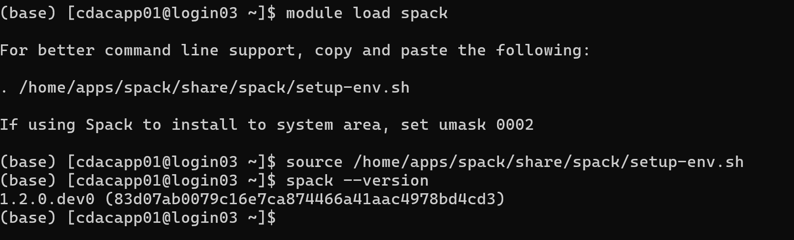
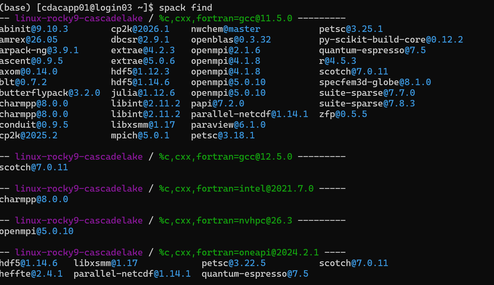
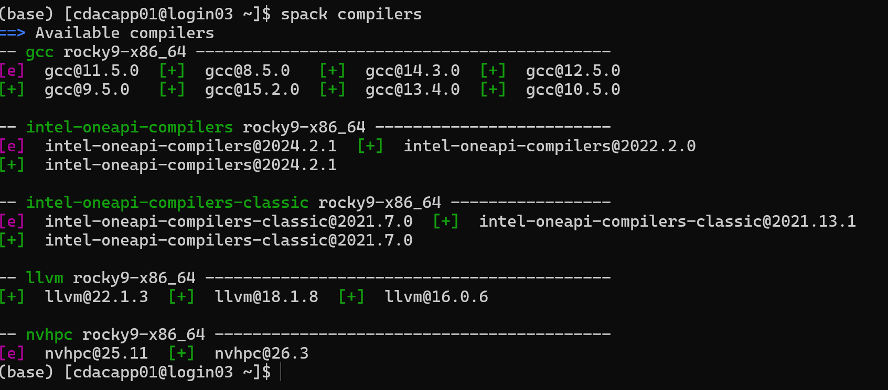

# Spack Packages

PARAM Rudra **extensively uses [Spack](https://spack.io/)** as its primary
package manager. Almost all applications, compilers and libraries are provided
through Spack, letting you load a specific version of a package **with all its
dependencies** into your environment on demand.

## Set up Spack in your shell

```bash
module load spack
. /home/apps/spack/share/spack/setup-env.sh      # note the leading dot
```
<br>

{ loading=lazy }
<br>

Or set the root explicitly (equivalent):

```bash
export SPACK_ROOT=/home/apps/spack
. $SPACK_ROOT/share/spack/setup-env.sh
```

Put these two lines at the top of your **job scripts** (and, if you like, in
`~/.bashrc`) so Spack is available before you `spack load` anything.

## Use Pre-Installed Applications from Spack:

**spack find**

The spack find command is used to query installed packages on PARAM Rudra. Note that some packages appear identical with the default output. The -l flag shows the hash of each package, and the -f flag shows any non-empty compiler flags of those packages.


```bash
spack find                 # packages already installed on the system
spack find -l              # show the short hash of each install
spack find -l gromacs      # installed variants of one package
spack list                 # all packages Spack *could* build
spack list gromacs         # search (wildcards added automatically)
spack compilers            # compilers Spack knows about (alias: spack compiler list)
```
<br>

{ loading=lazy }

Some packages have several builds that look identical in the default output —
the **hash** (`spack find -l`) disambiguates them.

## Loading a package

```bash
# By name (uses the default/preferred install)
spack load intel-oneapi-compilers

# Pin a version
spack load gromacs@2026.1

# Pin an exact build by hash (most reproducible)
spack load intel-oneapi-compilers /6asbh6t
spack load gromacs@5.1.4 /73dy73q
```

!!! tip "Pin the hash in job scripts"
    Loading `pkg /hash` guarantees you get the exact build you tested, even if a
    newer default is installed later. Get the hash from `spack find -l <pkg>`.

A typical Intel toolchain load looks like:

```bash
spack load intel-oneapi-compilers /6asbh6t
spack load intel-oneapi-mpi        /ptyduik
spack load intel-oneapi-mkl        /joptats
spack load gcc@13.4.0
```

## Spack spec syntax (operators)

| Operator | Meaning | Example |
| --- | --- | --- |
| `@` | version | `gromacs@2026.1` |
| `%` | compiler to build with | `%intel-oneapi-compilers` |
| `+` | enable a variant | `+cuda +mpi` |
| `~` | disable a variant | `~mpi` |
| `^` | choose a dependency | `^intel-oneapi-mkl` |
| `/` | select an exact build by hash | `/73dy73q` |
| `cuda_arch=` | GPU architecture | `cuda_arch=80` (A100) |

## Installing a new package (into your own space)

If a package isn't already installed, you can build it for yourself:

```bash
spack compilers                    # see available compilers first
spack list <name>                  # confirm the package exists in the repo
spack spec <name>                  # preview the concretized build + deps
spack install <name>@<version> ...
```
<br>

{loading=lazy}
<br>

Example — GROMACS with CUDA + MPI, Intel compilers and MKL, for A100 GPUs
(A100 = `cuda_arch=80`; the example below targets Hopper `90`, adjust to `80`):

```bash
spack install gromacs@2026.1 +cuda +mpi cuda_arch=80 \
    %intel-oneapi-compilers ^intel-oneapi-mkl
```

Uninstall something you no longer need:

```bash
spack uninstall zlib %gcc@13.4.0
```

!!! warning "Installs consume your quota and time"
    Spack builds land under your space and can be large and slow. Do big
    installs inside an [interactive job](batch.md#interactive-jobs), and mind
    your 50 GB `/home` quota — consider `/scratch` for bulky builds (subject to
    the [3-month purge](data.md)).

## Spack environments

Spack has an environment feature in which you can group installed software. You can install software with different versions and dependencies in each environment and can change software to use at once by changing environments. You can create a Spack environment by *`spack env create`* command. You can create multiple environments by specifying different environment names here.


Group software into named environments so different projects don't collide:

```bash
spack env create myenv           # create
spack env activate -p myenv      # activate (-p shows env name in prompt)
spack install <pkg>              # installs into the active env
spack env deactivate             # leave
spack env list                   # list your environments
```

## Using Spack in a job script

```bash
#!/bin/bash
#SBATCH -J spack-job
#SBATCH -A myproject
#SBATCH -p cpu
#SBATCH -N 1
#SBATCH --ntasks-per-node=48
#SBATCH -t 01:00:00
#SBATCH -o %x-%j.out

export SPACK_ROOT=/home/apps/spack
. $SPACK_ROOT/share/spack/setup-env.sh

spack load intel-oneapi-compilers /6asbh6t
spack load intel-oneapi-mpi        /ptyduik
spack load intel-oneapi-mkl        /joptats

cd $SLURM_SUBMIT_DIR
srun --mpi=auto -n $SLURM_NTASKS ./my_app
```

See [Building Software](building.md) for compiling your own code against these
Spack toolchains, and [Applications](applications/index.md) for ready-made
application scripts (GROMACS, LAMMPS, WRF, …).

!!! note "Packaging (advanced)"
    Application developers can write their own Spack **package recipes**
    (`package.py`) to build in-house codes reproducibly — see the
    [Spack Packaging Guide](https://spack.readthedocs.io/en/latest/packaging_guide.html).
