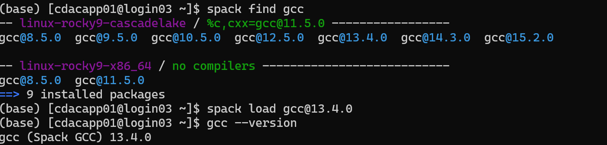

# Spack Packages

PARAM Rudra **extensively uses [Spack](https://spack.io/)** as its primary
package manager. Almost all applications, compilers and libraries are provided
through Spack, letting you load a specific version of a package **with all its
dependencies** into your environment on demand.

## Introduction

Spack automates the download-build-install process for software - including dependencies - and provides convenient management of versions and build configurations. It is designed to support multiple versions and configurations of software on a wide variety of platforms and environments. It is designed for large supercomputing centers, where many users and application teams share common installations of software on clusters with exotic architectures, using libraries that do not have a standard ABI. Spack is non-destructive: installing a new version does not break existing installations, so many configurations can coexist on the same system.

## Set up Spack in your shell

```bash
module load spack
. /home/apps/spack/share/spack/setup-env.sh      # note the leading dot
```
<br>

{ loading=lazy }
<br>

Or set the root explicitly (equivalent):

```bash
export SPACK_ROOT=/home/apps/spack
. $SPACK_ROOT/share/spack/setup-env.sh
```

Put these two lines at the top of your **job scripts** (and, if you like, in
`~/.bashrc`) so Spack is available before you `spack load` anything.

## Use Pre-Installed Applications from Spack:

**spack find**

The spack find command is used to query installed packages on PARAM Rudra. Note that some packages appear identical with the default output. The -l flag shows the hash of each package, and the -f flag shows any non-empty compiler flags of those packages.


```bash
spack find                 # packages already installed on the system
spack find -l              # show the short hash of each install
spack find -l gromacs      # installed variants of one package
spack list                 # all packages Spack *could* build
spack list gromacs         # search (wildcards added automatically)
spack compilers            # compilers Spack knows about (alias: spack compiler list)
```
<br>

{ loading=lazy }

Some packages have several builds that look identical in the default output —
the **hash** (`spack find -l`) disambiguates them.

## Loading a package

```bash
# By name (uses the default/preferred install)
spack load intel-oneapi-compilers

# Pin a version
spack load gromacs@2026.1

# Pin an exact build by hash (most reproducible)
spack load intel-oneapi-compilers /6asbh6t
spack load gromacs@5.1.4 /73dy73q
```

{ loading=lazy }

Figure: Loading gcc through SPACK

!!! tip "Pin the hash in job scripts"
    Loading `pkg /hash` guarantees you get the exact build you tested, even if a
    newer default is installed later. Get the hash from `spack find -l <pkg>`.

A typical Intel toolchain load looks like:

```bash
spack load intel-oneapi-compilers /6asbh6t
spack load intel-oneapi-mpi        /ptyduik
spack load intel-oneapi-mkl        /joptats
spack load gcc@13.4.0
```

## Spack spec syntax (operators)

| Operator | Meaning | Example |
| --- | --- | --- |
| `@` | version | `gromacs@2026.1` |
| `%` | compiler to build with | `%intel-oneapi-compilers` |
| `+` | enable a variant | `+cuda +mpi` |
| `~` | disable a variant | `~mpi` |
| `^` | choose a dependency | `^intel-oneapi-mkl` |
| `/` | select an exact build by hash | `/73dy73q` |
| `cuda_arch=` | GPU architecture | `cuda_arch=80` (A100) |

## Installing a new package (into your own space)

If a package isn't already installed, you can build it for yourself:

```bash
spack compilers                    # see available compilers first
spack list <name>                  # confirm the package exists in the repo
spack spec <name>                  # preview the concretized build + deps
spack install <name>@<version> ...
```
<br>

{loading=lazy}
<br>

Example — GROMACS with CUDA + MPI, Intel compilers and MKL, for A100 GPUs
(A100 = `cuda_arch=80`; the example below targets Hopper `90`, adjust to `80`):

```bash
spack install gromacs@2026.1 +cuda +mpi cuda_arch=80 \
    %intel-oneapi-compilers ^intel-oneapi-mkl
```

Uninstall something you no longer need:

```bash
spack uninstall zlib %gcc@13.4.0
```

!!! warning "Installs consume your quota and time"
    Spack builds land under your space and can be large and slow. Do big
    installs inside an [interactive job](batch.md#interactive-jobs), and mind
    your 50 GB `/home` quota — consider `/scratch` for bulky builds (subject to
    the [3-month purge](data.md)).

## Spack environments

Spack has an environment feature in which you can group installed software. You can install software with different versions and dependencies in each environment and can change software to use at once by changing environments. You can create a Spack environment by *`spack env create`* command. You can create multiple environments by specifying different environment names here.


Group software into named environments so different projects don't collide:

```bash
spack env create myenv           # create
spack env activate -p myenv      # activate (-p shows env name in prompt)
spack install <pkg>              # installs into the active env
spack env deactivate             # leave
spack env list                   # list your environments
```

## Packaging (For Application developers)

Spack packages are installation scripts, which are essentially recipes for building the software.

They define properties and behaviour of the build, such as:

- where to find and how to retrieve the software.

- its dependencies.

- options for building the software from source; and

- build commands.

Once we’ve specified a package’s recipe, users of our recipe can ask Spack to build the software with different features on any of the supported systems. [Refer Packaging Guide — Spack documentation](https://spack.readthedocs.io/en/latest/packaging_guide_creation.html) for detailed understanding of the Spack packaging.

Example Creating Own Package:

In the below spec file we have used **Linewidth, an IISc developed code.** See the bold lines for comments related to preceding lines in the spec file of spack package named IiscLinewidth:

```bash
# Copyright 2013-2021 Lawrence Livermore National Security, LLC and other # Spack Project Developers. See the top-level COPYRIGHT file for details. #
# SPDX-License-Identifier: (Apache-2.0 OR MIT) import os
import platform import sys
import llnl.util.tty as tty from spack import *
class IiscLinewidth(MakefilePackage): """
Linewidth developed by IISC Banglore. """
homepage = ""
#Url for homepage
url	= "file://{0}/linewidth.tar.gz".format(os.getcwd())
#Url for source code
manual_download = True
#If source code is not available in public domain
version('1', sha256='7215f6765e5f5eddfde5f0c67a5bbdef5960607f3e199a609ef5619278ec8a66',
preferred=True)
#You can add different versions for you package.
variant('mpi', default=True, description='Install with MPI support') variant('openmp', default=True, description='Install with OpenMP
support')
#Variant gives flexibility to users for changing parameter before compilation.
depends_on('gmake', type='build') depends_on('mpi', when='+mpi') depends_on('hdf5+fortran+hl+mpi') depends_on('intel-mkl') depends_on('py-h5py')
depends_on('py-matplotlib', type=('build', 'run'))
#Depend clause used to specify dependencies for your code.
@property
def build_targets(self): targets = [
#'--directory=SRC', '--file=Makefile',
'LIBS={0} {1} '.format(self.spec['intel-mkl'].libs.ld_flags,
self.spec['hdf5'].libs.ld_flags), 'HDFINCFLAGS={0}'.format(self.spec['hdf5'].prefix.include), 'HDF5_HOME={0}'.format(self.spec['hdf5'].prefix), 'FC={0}'.format(self.spec['mpi'].mpifc)
]
return targets
def install(self, spec, prefix): mkdirp(prefix.bin) install('linewidth', prefix.bin)
####
#This code uses Makefile for building application. We can define some properties
# to make changes in Makefile, changing parameter in Makefile at compile time.
```


## Sample steps taken for creating linewidth application recipe for Spack

- Source code: 

    Source code of Linewidth was not available through a public repo like GitHub, so needed to import OS package.

    os.getcwd() - expects the source tar present in current working directory. cha256 - to check for sha256 checksum we added same in version clause and for place holder we have given version as 1.

    manual download = True refers to spack will not try to download source code for the package.

    name - make sure that name of tar file is same as used inside package recipe

- Variant- User can control behavior of application being built through this clause. Ex- To enable MPI support we have defined it to be true by default.

- depends_on() - This clause defines all dependencies required to build the given application.
Ex- In linewidth example we have used Intel-MKl and HDF5.

- @property - With this decorator we can define some properties for build system like edit, build, install.

- property build_targets - Defines logic of building source for native platform.

- property install - Defines install procedure to be used after building source code. Ex- In our example we define prefix path

## Sample SLURM script for OpenMP applications/programs. to use Spack

```bash
#!/bin/bash
#SBATCH --nodes=1
#SBATCH -p cpu        # cpu/gpu/standard
#SBATCH --exclusive
#SBATCH -t 1:00:00


echo "SLURM_JOBID = $SLURM_JOBID"
echo "SLURM_JOB_NODELIST = $SLURM_JOB_NODELIST"
echo "SLURM_NNODES = $SLURM_NNODES"
echo "SLURM_NTASKS = $SLURM_NTASKS"


# ---------------- Environment ----------------
source /home/apps/spack/share/spack/setup-env.sh


# Load compiler (adjust as needed)
spack load gcc@13.4.0
spack load intel-oneapi-compilers /6asbh6t 


# ---------------- OpenMP tuning ----------------
export OMP_NUM_THREADS=$SLURM_CPUS_PER_TASK
export OMP_PROC_BIND=close
export OMP_PLACES=cores


# ---------------- Run ----------------
./a.out
```


## Using Spack in a job script

```bash
#!/bin/bash
#SBATCH -J spack-job
#SBATCH -A myproject
#SBATCH -p cpu
#SBATCH -N 1
#SBATCH --ntasks-per-node=48
#SBATCH -t 01:00:00
#SBATCH -o %x-%j.out

export SPACK_ROOT=/home/apps/spack
. $SPACK_ROOT/share/spack/setup-env.sh

spack load intel-oneapi-compilers /6asbh6t
spack load intel-oneapi-mpi        /ptyduik
spack load intel-oneapi-mkl        /joptats

cd $SLURM_SUBMIT_DIR
srun --mpi=auto -n $SLURM_NTASKS ./my_app
```

See [Building Software](building.md) for compiling your own code against these
Spack toolchains, and [Applications](applications/index.md) for ready-made
application scripts (GROMACS, LAMMPS, WRF, …).

!!! note "Packaging (advanced)"
    Application developers can write their own Spack **package recipes**
    (`package.py`) to build in-house codes reproducibly — see the
    [Spack Packaging Guide](https://spack.readthedocs.io/en/latest/packaging_guide.html).
